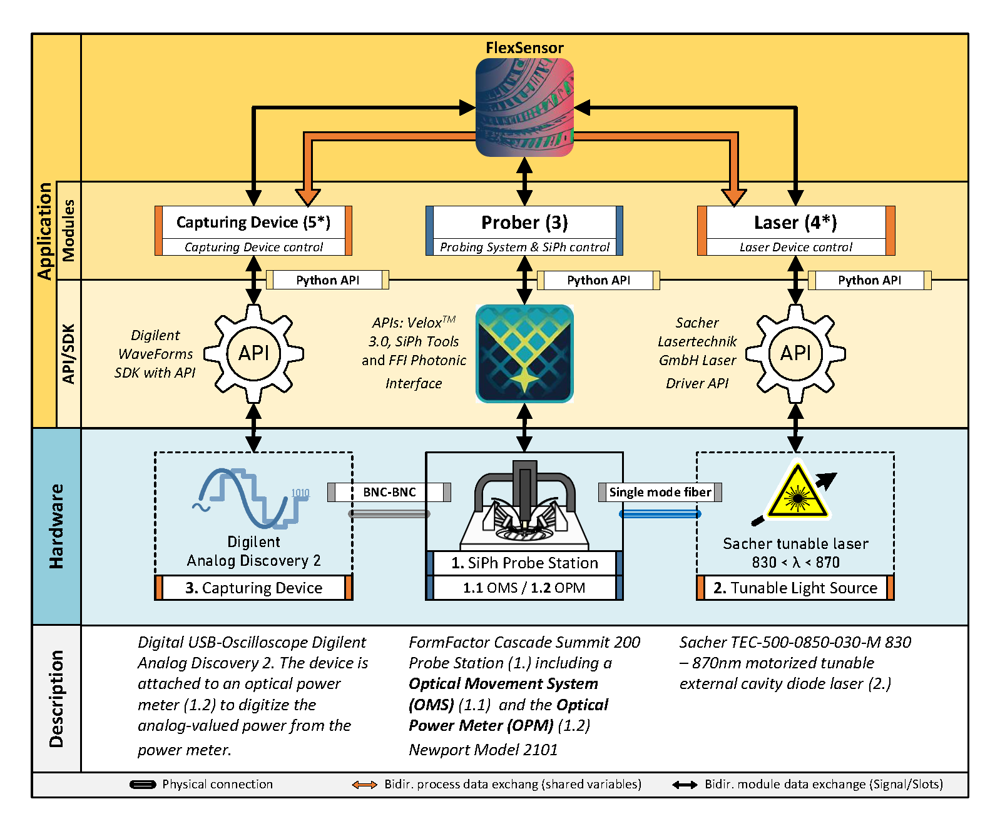

# Flexsensor

An automation software for [FormFactor Cascade Summit200](https://www.formfactor.com/product/probe-systems/200-mm-systems/summit200/) Probe Stations.
*FlexSensor* is a software that automates measurements using the FormFactor Wafer Prober.

*FlexSensor* is a standalone Python application. Its versatility allows for immediate deployment without prior programming knowledge. Particularly noteworthy are its post-processing capabilities, however, the software's core functionality is the use of the automated measurement routine to acquire the resonant spectra of photonic devices integrated within a specialized measurement system, as detailed in Section 

# About this project
This work introduces the automation measurement software FlexSensor for capturing resonant spectra, an innovative and extensible software program developed explicitly for measuring and evaluating wafer-level Silicon Photonics (SiPh) circuits. Wafer-level SiPh allows the integration of numerous optical components and structures on a single wafer. However, researchers and engineers need precise and repeatable measurements to characterize them and face significant challenges when dealing with large numbers of complex systems on a single wafer. A toolchain gap hampers the measuring of such highly integrated photonic structures: While the setup necessitates the integration of an optimized hardware and software toolchain, there is neither software nor a standardized way to implement a reproducible measurement routine for a massive set of measurements. 

FlexSensor allows integration and control of external hardware (tunable lasers, analog-digital converters) and supports measurement data storage and evaluation. 
The software enables researchers and engineers to efficiently analyze the spectral response of photonic structures and facilitate rapid measuring. 

This software depends on several sub-projects and serves as the control unit.




## Still under construction*
This repository is under construction. The software is ready for deployment but is still in beta. 
If you find any bugs or have any suggestions, please open an issue.

# Installation
## Get the source files
Clone the repository [git@gitlab.tugraz.at:flexsensor-public/flexsensor.git](https://github.com/agentsmith29/flexsensor.git) to your local machine.
```bash
git clone https://github.com/agentsmith29/flexsensor.git
```

Create a virtual environment (highly recommended) and install the dependencies.
```python
python -m venv .venv;
source .venv/Scripts/Activate;
pip install -r requirements.txt
```

# Starting the software
To start the software, run the [`./examples/main.py`](https://github.com/agentsmith29/flexsensor/blob/main/examples/main.py) file. 
```python
python main.py
```

# Defining a measurement routine
The measurement routine is defined in a Python file (e.g., [./examples/MeasurementRoutine.py](https://github.com/agentsmith29/flexsensor/blob/main/examples/MeasurementRoutine.py)). Each measurement routine must be inherited from [`BaseMeasurementRoutine`](https://github.com/agentsmith29/flexsensor/blob/main/src/FlexSensor/MeasurementRoutines/BaseMeasurementRoutine.py) class.
Note that the base class has an overloaded constructor that requires the following parameters:
- `prober`: The Prober.Controller object that is used to measure the structures
- `config`: The FlexSensorConfig object that is used to measure the structures
```python
import FlexSensor as fs

class MeasurementRoutine(fs.BaseMeasurementRoutine):

    def __init__(prober: Prober.Controller,
                 config: fs.FlexSensorConfig):
        super().__init__(prober, config)

    @Slot()
    def run(self): 
        # your code here
```
In the `run` method, the measurement routine is defined. 
The `run` method is called by the `MeasurementRoutineThread` class, which is a QThread object. This allows to run the method
in a separate thread, while the GUI remains responsive. 


# Measuring using FlexSensor
It is often useful to measure a large number of structures on a wafer. For this, the software allows to define a
measurement routine that is executed for each structure. 
The `vas`-File allows to define a list of structures that are measured. Thede file is parsed and passed
to the `MeasurementRoutine` class.
```python
import FlexSensor as fs
# ...
def readVasFile(self):
    self.parsed_file = fs.VASInputFileParser()
    
    selected_file, self.grouped_structures, self.bookmarks = self.parsed_file.read_file(
         input_file='structure_file.vas'
     )
# ...
```
The `VASInputFileParser` class parses the `vas`-File and returns a list of structures that are measured.
- `selected_file`: The selected file. In case the file is not found, the user is prompted to select a file by a file dialog.
- `grouped_structures`: A list of structures that are measured. Each structure is a python dictionary that contains the
  information on how to measure the structure.
- `bookmarks`: A list of bookmarks that are defined in the `vas`-File. These bookmarks are used to create a Klayout
  bookmark file that can be used to navigate to the structures in Klayout.
## Input Structure File
The measuring process relies on a ```vas```-File that store the positions to the structures. in priciple 
this file os a list of python dictionary in a predefined format, that allows the easy definiton
on how to measure the structures. 
The file allows python-style line comments using the ```#```-sign
### Comments and Bookmarks
```python
# First structure to measure  
# group="mrr1"
```
Sometimes it is useful to have the Klayout-positions bookmarked. Using the Klayout-Coordinates, the
software creates a readable Bookmark file that can be used in Klayout.
```python
# Bookmark this view
mrr1_bookmark = { 'x_left': 19012, 'x_right' : 20708, 'y_bottom' : 20185, 'y_top': 21866 }
```
### Defining a measurement point
Defining a measurement point requires the input position (`x_in`, `y_in`) and the output 
position (`x_out`, `y_out`). The keyword `repetitions` allows to define the number of repeated measurements of the same
structure (e.g., for statistical evaluation, etc.)
<br> 
**These positions are relative and measured from a predefined point (See Sec ...) on how
to select this point which can be chosen arbitrarily.**
```python
mrr1_ref = {'y_in' : -2120, 'x_in' : 960, 'y_out' : -2120, 'x_out' : -155, 'repetitions': 2}
```
Sometimes it is useful to define a group of measurement points that are equally spaced in x-direction. For this, the 
`spacing` and `num`-keyword can be used. Using these values, the software will automatically generate a list of 
`num` structures, equally spaced in x-direction using the `spacing` value. 
```python
mrr1     = {'y_in' : -1845, 'x_in' : 960, 'y_out' : -2015, 'x_out' : -155,  'num' : 6, 'spacing' : 100, 'repetitons': 200}
```

## Setup before measuring
1. Open the correct wafer map. 
Open the wafer Map under **Velox** -> **WaferMap**. Load the correct wafer file and select or deselect dies you do not 
want to capture. 

 **Note**: Make sure that the die and wafer size is correct.
2. Auto-Align the Wafer
 For this open the "AutoAlign" Wizard  and find a suitable alignment structure. 

3. Place at "your" origin
The structure file relies on "relative" positions to a point you
find a suitable structur which is defined as the "die" origin. This is used to  measure the distance to the to/be measured strcutures. Use the same mark in zour Klayout file and on the wafer. 

If you have not yet created a list for measuring your structure, you can use 
- the wafer prober find the right coordinates.
- the KLayout-File for measuring the structures
5. Set contact height
Set our fiber to the correct height. Then use the "Set Contact height". Otherwise the measurement routine will fail!
6. Train the Home Positions
This step is crucial and needed to train the output positions.


# Licence and usage
This software is licensed under the [GNU GPL v3](https://www.gnu.org/licenses/gpl-3.0.de.html). 
If you use this software for your work or in your papers, please cite the following:

# Citing
This project is part of the Software [FlexSensor](https://github.com/agentsmith29/flexsensor), which has been published under DOI [https://doi.org/10.2139/ssrn.4828876](https://doi.org/10.1016/j.softx.2024.101879).

Example citing (IEEE):
```
[1] C. Schmidt, J. W. Hinum-Wagner, R. Klambauer, and A. Bergmann, “FlexSensor: Automated measurement software for rapid photonic circuits capturing,” SoftwareX, vol. 27, p. 101879, 2024, doi: https://doi.org/10.1016/j.softx.2024.101879.
```
or using a *BiBTex* 
```bib
@article{SCHMIDT2024101879,
    title = {FlexSensor: Automated measurement software for rapid photonic circuits capturing},
    journal = {SoftwareX},
    volume = {27},
    pages = {101879},
    year = {2024},
    issn = {2352-7110},
    doi = {https://doi.org/10.1016/j.softx.2024.101879},
    url = {https://www.sciencedirect.com/science/article/pii/S2352711024002498},
    author = {Christoph Schmidt and Jakob Wilhelm Hinum-Wagner and Reinhard Klambauer and Alexander Bergmann},
    keywords = {Silicon photonics, Wafer-level measurements, Measurement automation, Graphical user interface},
    abstract = {This paper introduces the automation measurement software FlexSensor for capturing resonant spectra, an innovative and extensible software program developed explicitly for measuring and evaluating wafer-level Silicon Photonic (SiPh) circuits. Wafer-level Silicon Photonics allows the integration of numerous optical components and structures on a single wafer. However, researchers and engineers need precise and repeatable measurements to characterize them and face significant challenges when dealing with large numbers of complex systems on a single wafer. A toolchain gap hampers the measuring of such highly integrated photonic structures: While the setup necessitates the integration of an optimized hardware and software toolchain, there is neither software nor a standardized way to implement a reproducible measurement routine for a massive set of measurements. FlexSensor allows integration and control of external hardware (tunable lasers, analog–digital converters) and supports measurement data storage and evaluation. The software enables researchers and engineers to efficiently analyze the spectral response of photonic structures and facilitate rapid measuring.}
}
```

# FAQ&Issues
This section should cover the issues that may occur during usage or development. 

## Installation issues and running
There are some combinations of pyside6 and pyqtgraph that may lead to incompatibility
issues. Especially `PySide 6.5.0` and `pyqtgraph 0.13.2` installation lead to 
```python
TypeError: GraphicsWidgetAnchor.__init__() takes 1 positional argument but 2 were given
```
[Solution](https://stackoverflow.com/questions/76005506/pyqtgraphs-graphicswidgetanchor-class-incomplatible-with-pyside6?noredirect=1#comment134055507_76005506):
Remove your current installed pyqtgraph and install the latest version:
```python
pip install git+https://github.com/pyqtgraph/pyqtgraph@master
```
